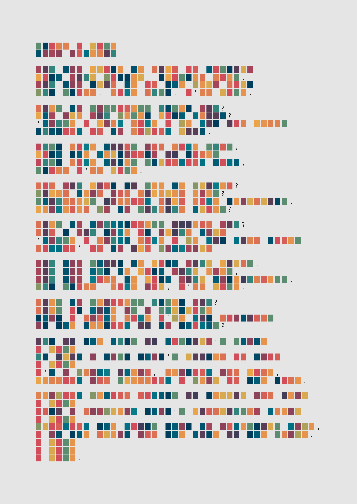

# Data Viz Projects

## Nobel Prize Laureates

  

## Typography Cartography (Map of Scotland)

  

## Lemur Family Tree

  

## Poetry

  

## Forest of Bowland

  

## Sea Surface Temperatures

  

## Heatmap Blanket Knitting Pattern

  

## London Marathon

  

## #TidyTuesday Wrapped

  

  

## Western States 100

  

