This site hosts a collection of [my](https://nrennie.rbind.io/) miscellaneous data visualisation projects. This home page includes all static charts, but you can also explore different interactive visualisations via the *Interactive projects* tab.

## Bob Ross Paintings

{width="100%"}

## Forest of Bowland

{width="100%"}

## General Health

::: {.grid}

::: {.g-col-12 .g-col-md-6}

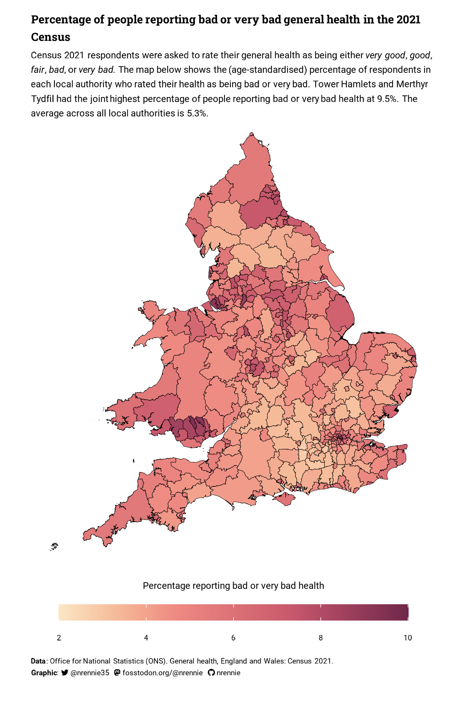{width="100%"}

:::

::: {.g-col-12 .g-col-md-6}

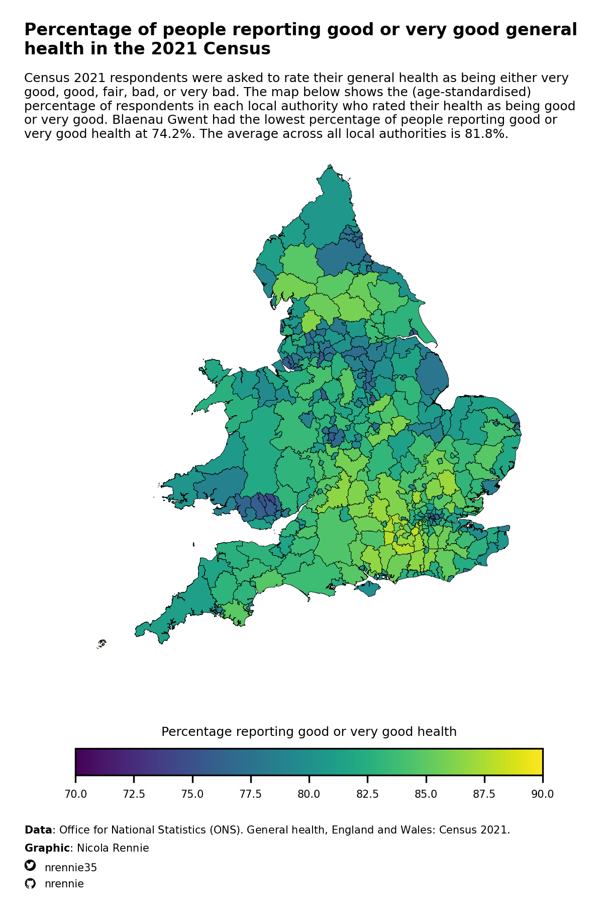{width="100%"}

:::

:::

## Heatmap Blanket Pattern

::: {.grid}

::: {.g-col-12 .g-col-md-6}
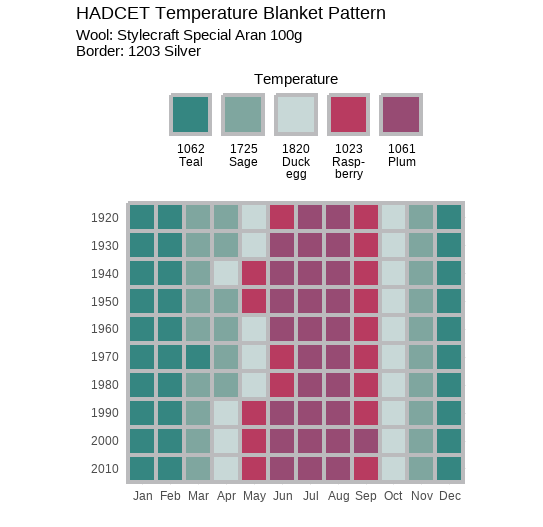{width="100%"}
:::

::: {.g-col-12 .g-col-md-6}
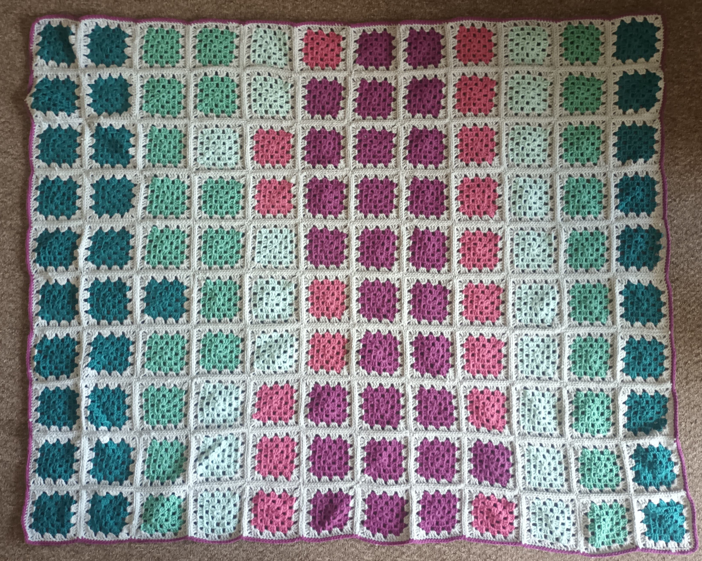{width="100%"}
:::

:::

## History of the Akimel O’odham

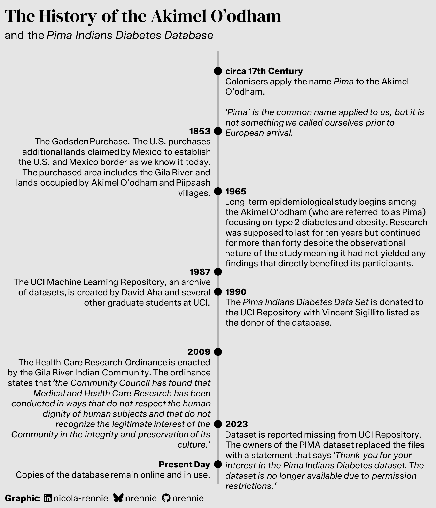{width="100%"}

## Income Inequality

Explore the [interactive version](/income-inequality/).

{width="100%"}

## Lemur Family Tree

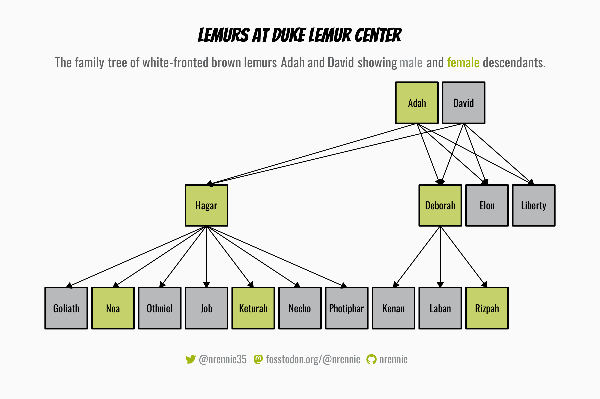{width="100%"}

## Local council elections

Explore the [interactive version](/local-council-elections/).

{width="100%"}

## London Marathon

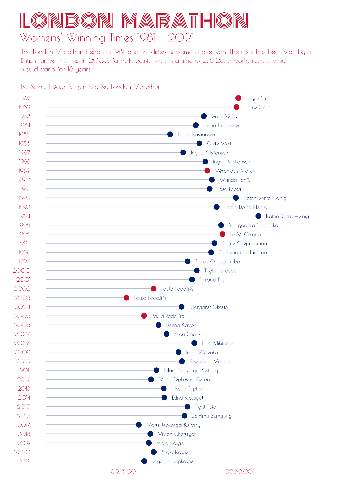{width="100%"}

## Nobel Prize Laureates

{width="100%"}

## Periodic Table

Explore the [interactive version](/periodic-table/).

{width="100%"}

## Poetry

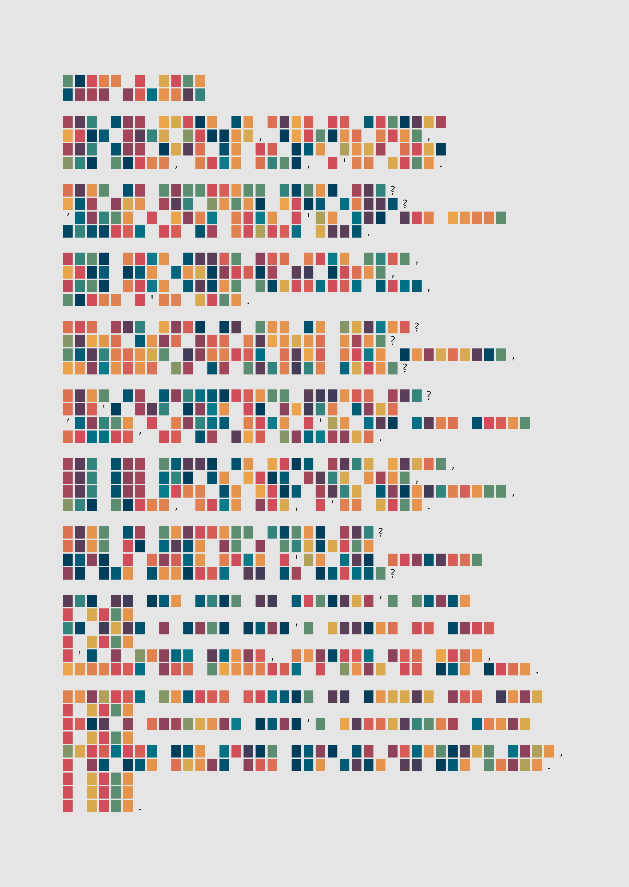{width="100%"}

## Reading Shelf

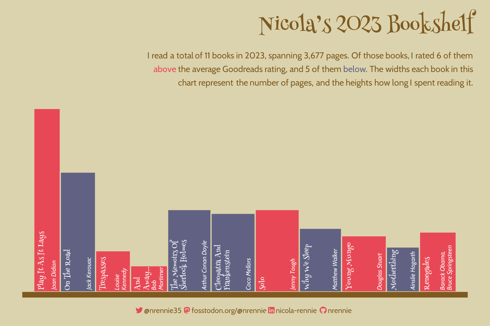{width="100%"}
## Sea Surface Temperatures

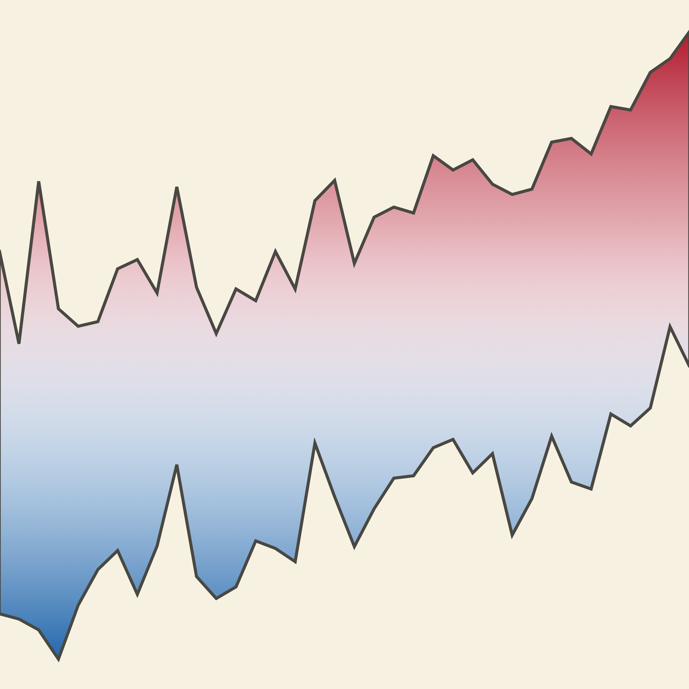{width="100%"}

## Shakespeare's Sonnets

::: {.grid}

::: {.g-col-12 .g-col-md-4}
{width="100%"}
:::

::: {.g-col-12 .g-col-md-4}
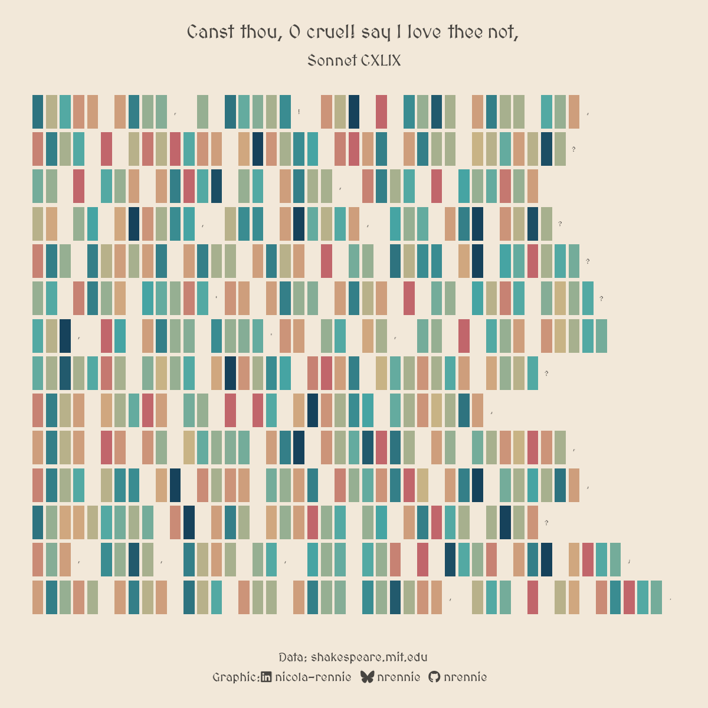{width="100%"}
:::

::: {.g-col-12 .g-col-md-4}
{width="100%"}
:::

:::

## TidyTuesday Wrapped

Summary of my most used R functions and packages in [TidyTuesday visualisations](https://github.com/nrennie/tidytuesday), inspired by Spotify Wrapped.

::: {.grid}

::: {.g-col-12 .g-col-md-6}
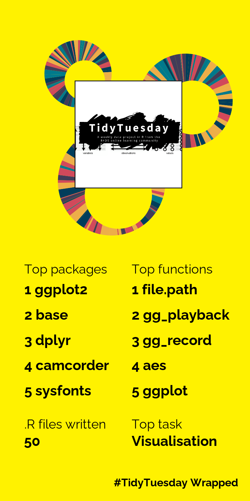{width="100%"}
:::

::: {.g-col-12 .g-col-md-6}
{width="100%"}
:::

:::

## Typography Cartography

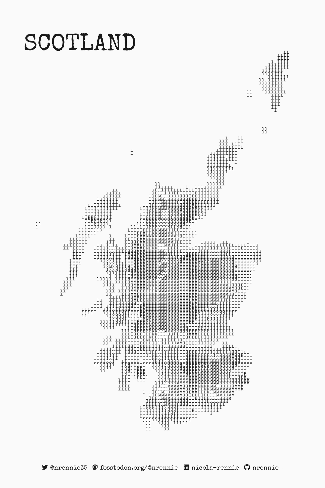{width="100%"}

## Western States 100

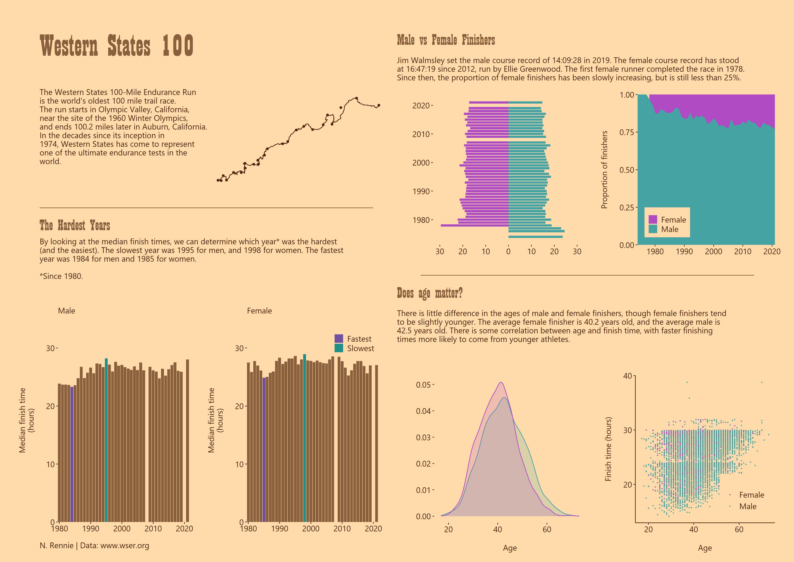{width="100%"}

## xkcd Colors

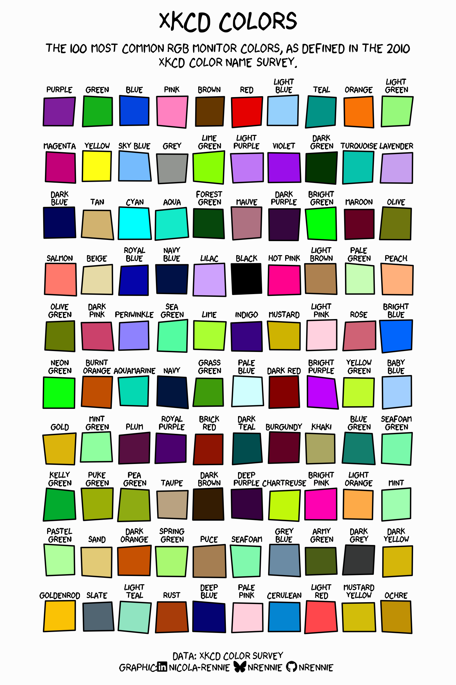{width="100%"}

The source code for all charts can be found on [GitHub](https://github.com/nrennie/data-viz-projects).